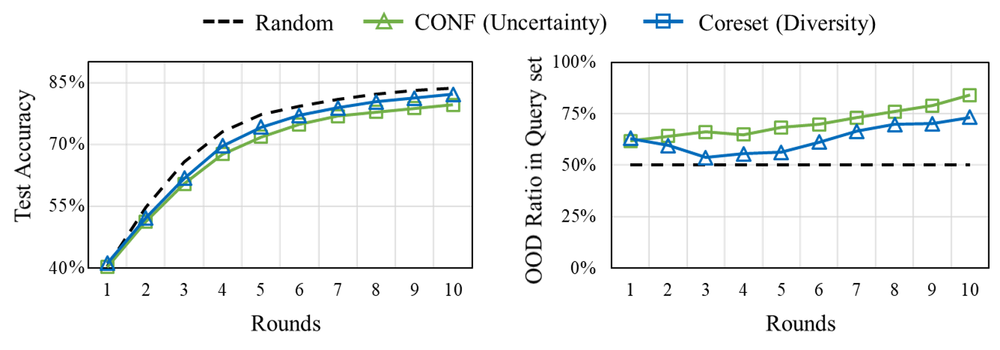
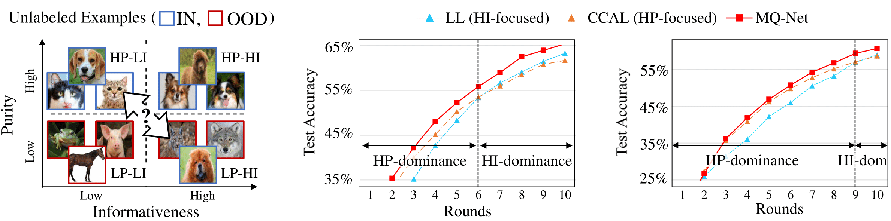
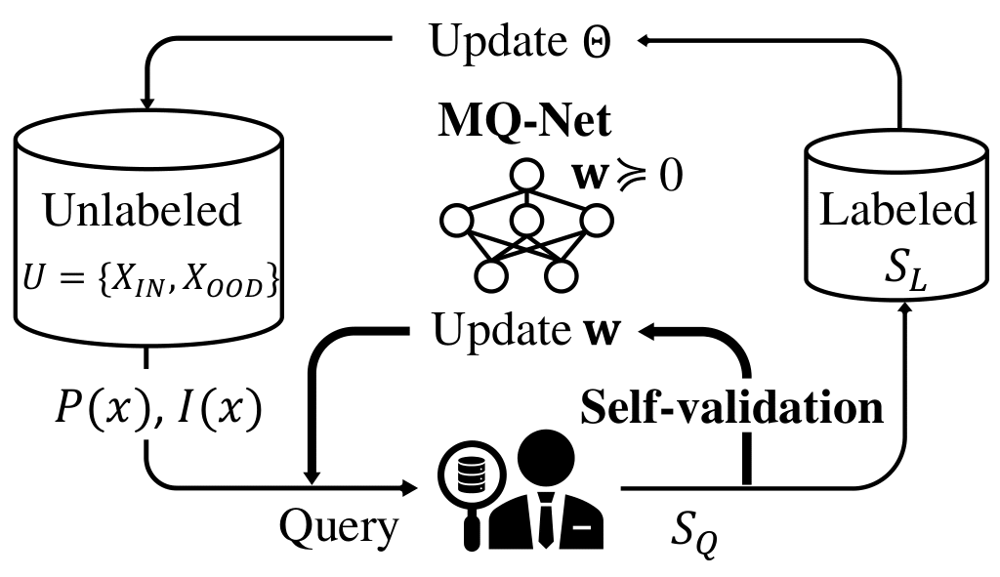
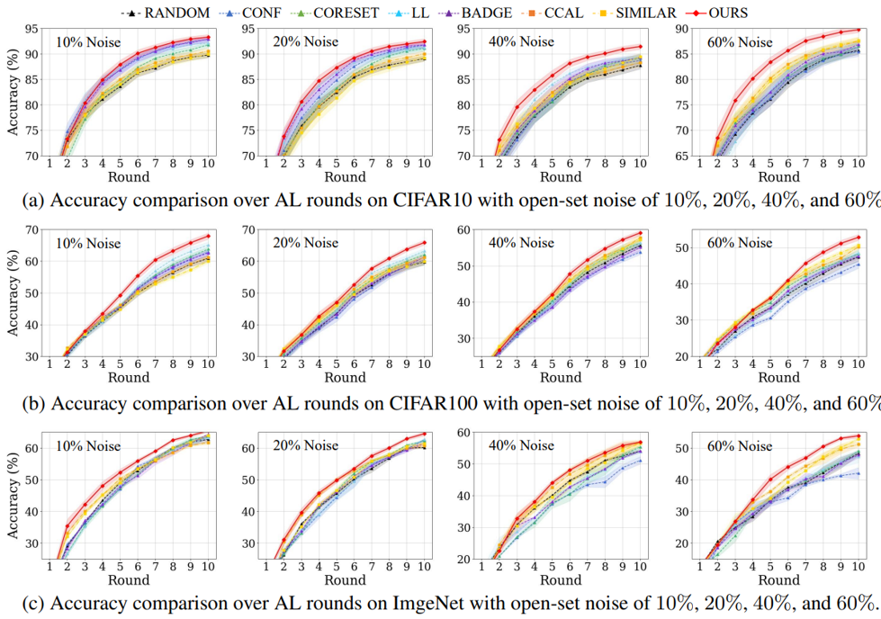

# Meta-Query-Net: Resolving Purity-Informativeness Dilemma in Open-set Active Learning (NeurIPS 2022, [PDF](https://arxiv.org/pdf/2210.07805.pdf))
      
by [Dongmin Park](https://scholar.google.com/citations?user=4xXYQl0AAAAJ&hl=ko)<sup>1</sup>, [Yooju Shin](https://scholar.google.com/citations?user=b4_yMt4AAAAJ&hl=ko)<sup>1</sup>, [Jihwan Bang](https://scholar.google.com/citations?user=molKYzwAAAAJ&hl=ko&oi=ao)<sup>2,3</sup>, [Youngjun Lee](https://scholar.google.com/citations?user=ZOrPKx0AAAAJ&hl=ko&oi=sra), [Hwanjun Song](https://scholar.google.com/citations?user=Ijzuc-8AAAAJ&hl=en&oi=ao)<sup>2</sup>, [Jae-Gil Lee](https://scholar.google.com/citations?user=h9mbv9MAAAAJ&hl=ko)<sup>1</sup>

<sup>1</sup> KAIST, <sup>2</sup> NAVER AI Lab, <sup>3</sup> NAVER CLOVA

* **`Oct 19, 2022`:** **Our work is publicly available at [ArXiv](https://arxiv.org/abs/2210.07805).**
* **`Dec 28, 2022`:** **Our work is published in NeurIPS 2022.**

# How to run

### MQ-Net 

* CIFAR10
```bash
python3 main_split.py --epochs 200 --epochs-csi 1000 --epochs-mqnet 100 --datset 'CIFAR10' --n-class 10 --n-query 500 \
                      --method 'MQNet' --mqnet-mode 'LL' --ssl-save True --ood-rate 0.6
```
* CIFAR100
```bash
python3 main_split.py --epochs 200 --epochs-csi 1000 --epochs-mqnet 100 --datset 'CIFAR100' --n-class 100 --n-query 500 \
                      --method 'MQNet' --mqnet-mode 'LL' --ssl-save True --ood-rate 0.6
```
* ImageNet50
```bash
python3 main_split.py --epochs 200 --epochs-csi 1000 --epochs-mqnet 100 --datset 'ImageNet50' --n-class 50 --n-query 1000 \
                      --method 'MQNet' --mqnet-mode 'LL' --ssl-save True --ood-rate 0.6
```

* For ease of expedition, we provide CSI pre-trained models for split-experiment below

Noise Ratio | Architecture | CIFAR10 | CIFAR100 
-- | -- | -- | --
60\% | ResNet18 | [weights](https://www.dropbox.com/s/37sbc95jyak3fc7/CIFAR10_r0.6_csi_0.pt?dl=0) | [weights](https://www.dropbox.com/s/llbiazzanaohoqj/CIFAR100_r0.6_csi_0.pt?dl=0)

### Other Baselines: Uncertainty(CONF), CoreSet, LL, BADGE, CCAL, SIMILAR

* CIFAR10, CIFAR100, ImageNet50
```bash
python3 main_split.py --epochs 200 --datset $dataset --n-query $num_query --method $al_algorithm --ood-rate $ood_rate
```

# Requirements

```
torch: +1.3.0
torchvision: 1.7.0
torchlars: 0.1.2
prefetch_generator: 1.0.1
submodlib: 1.1.5
diffdist: 0.1
scikit-learn: 0.24.2
scipy: 1.5.4
```

# MQ-Net Overview

### Importance of Handling OOD examples in Active Learning

* OOD examples are **uncertain** in prediction & **diverse** in representation space
* They are **Likely to be queried** by standard AL algorithms, _e.g._, uncertainty- and diversity-based
* Since OOD examples are **useless** for target task, it wastes the labeling cost and significantly **degrades** AL performance

<p align="center">
 
</p>

* Above figures are AL performance on CIFAR10 mixed with SVHN at the open-set noise ratio of 50% (1:1 mixing)
* With a such high noise ratio, uncertainty- and diversity-based algorithms queried many OOD examples and thus become even worse than random selection

### Purity-Informativeness Dilemma in Open-set Active Learning

* Recently, two open-set AL algorithms, SIMILAR and CCAL, have been proposed and tried to increase in-distribution purity of query-set
* However, **"Should we focus on the purity throughout the entire AL period?"** remains a question

<p align="center">
 
</p>

* **Increasing purity ↔ Losing Informativeness** --> Trade-off!
* Which is more helpful? _Fewer but more informative examples_ vs _More but less informative examples_
* Optimal trade-off may **change** according to the AL rounds & noise ratios!

### MQ-Net

<p align="center">
 
</p>

* **Goal:** To keep finding the best balance between purity and informativeness
* **How**: Learn a meta query score function

### Result

<p align="center">
 
</p>


# Citation

```
@article{park2022meta,
  title={Meta-Query-Net: Resolving Purity-Informativeness Dilemma in Open-set Active Learning},
  author={Park, Dongmin and Shin, Yooju and Bang, Jihwan and Lee, Youngjun and Song, Hwanjun and Lee, Jae-Gil},
  journal={NeurIPS 2022},
  year={2022}
}
```

# References

* Coreset \[[code](https://github.com/svdesai/coreset-al)\] : Active Learning for Convolutional Neural Networks: A Core-Set Approach, Sener et al. 2018 ICLR
* LL \[[code](https://github.com/Mephisto405/Learning-Loss-for-Active-Learning)\] : Learning Loss for Active Learning, Yoo et al. 2019 CVPR
* BADGE \[[code](https://github.com/JordanAsh/badge)\] : Deep Batch Active Learning by Diverse, Uncertain Gradient Lower Bounds, Jordan et al. 2020 ICLR
* CCAL \[[code](https://github.com/RUC-DWBI-ML/CCAL)\] : Contrastive Coding for Active Learning under Class Distribution Mismatch, Du et al. 2021 ICCV
* SIMILAR \[[code](https://github.com/decile-team/distil)\] : SIMILAR: Submodular Information Measures based Active Learning in Realistic Scenarios, Kothawade et al. 2021 NeurIPS
 
 
 
 
 
 
 
 
 
